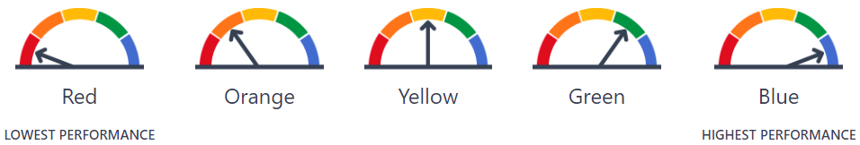

```{r setup, include = FALSE}
library(tidyverse)
library(flextable)
library(pins)

if (interactive()) {
  params <- rmarkdown::yaml_front_matter(
    rstudioapi::getSourceEditorContext()$path
  )$params
}

# 1. Establish robust project paths and load helpers ---------------------------
pins_path <- Sys.getenv("CDE_PINS_PATH")

if (pins_path == "") {
  stop("CDE_PINS_PATH environment variable is not set. Please add it to .Renviron.")
}

local_board <- board_folder(pins_path)

percent_indicators <- c("college/career", "graduation", "absenteeism", "suspension")

all_groups_to_orange <- read_csv("data/all_groups_to_orange.csv") |> 
  mutate(currstatus = if_else(indicator %in% percent_indicators,
                              paste0(currstatus, "%"), as.character(currstatus)))

# 2. Dynamically determine LEA Type and Group Count ----------------------------
if (params$student_group == "Homeless Youth") {
  homeless <- pin_read(local_board, "homeless_enrollment_clean")
  
  homeless_in_lea <- homeless |>
    filter(academic_year == params$year,
           county_name == params$county,
           (district_name == params$lea & aggregate_level == "D" & charter_school == "All" & dass == "All") |
             (aggregate_level == "S" & school_name == params$lea))
  
  group_count <- homeless_in_lea |>
    filter(reporting_long == "Total Students") |> 
    pull(homeless_student_enrollment) |> 
    nth(1)
  
  lea_type <- if_else(homeless_in_lea$aggregate_level[1] == "D", "School District", "")
  
} else {
  # Fallback: Extract LEA type and use max denominator as proxy for group count
  lea_info <- all_groups_to_orange |> 
    filter((school_name == params$lea & rtype == "S") | (district_name == params$lea & rtype == "D")) |> 
    slice(1)
  
  lea_type <- if_else(nrow(lea_info) > 0 && lea_info$rtype[1] == "D", "School District", "")
  
  group_count <- all_groups_to_orange |> 
    filter(
      academic_year == params$year,
      county_name == params$county,
      student_group_long == params$student_group,
      (school_name == params$lea & rtype == "S") | (district_name == params$lea & rtype == "D")
    ) |> 
    pull(currdenom) |> 
    max(na.rm = TRUE)
}

lea_print <- str_squish(paste(params$lea, lea_type))

intro_sentence <- paste0(
  "In the ", params$year, " school year, there were ", group_count, 
  " students included in the ", tolower(params$student_group), " student group at ", lea_print, "."
)

```

{fig-align="left" width="135"}

# Strategic Interconnectedness: A What-If Analysis for `r params$student_group` in `r lea_print`

The California Department of Education (CDE) produces the [California School Dashboard (Dashboard)](https://www.caschooldashboard.org/) annually reporting on several state indicators. The Dashboard assigns LEAs colors for each indicator and student group based on a combination of the group's current status and change from the previous year. Outcomes for vulnerable student groups, such as `r tolower(params$student_group)`, often fluctuate given the small and dynamic nature of the population making planning and prioritization difficult for administrators. However, by examining the intersectionality of these students with larger student groups, we can see how small, targeted interventions for the most vulnerable can have large, positive effects throughout the agency’s broader accountability landscape.

**What we are demonstrating:** This report uses a what-if scenario framework to demonstrate this interconnectedness. By repurposing the descriptive [5x5 colored tables](https://www.cde.ca.gov/ta/ac/cm/fivebyfivecolortables.asp) from the California School Dashboard for predictive analysis, we will show how hypothetical performance improvements in the `r tolower(params$student_group)` group could shift performance indicators for multiple intersecting student groups with similar outcomes.

{fig-align="left"}

`r intro_sentence` Starting with dashboard indicators where the `r tolower(params$student_group)` group was assigned a color of red (the lowest performance category), we identified other student groups assigned a red color in those same indicators. Holding the number of enrolled students constant, we then calculated the hypothetical difference in students it would take for each group to move from red to orange. 

```{r group_to_orange}
#| echo: FALSE
#| tbl-cap: "Hypothetical scenarios: How intersecting student reporting categories would be affected by improved outcomes, holding enrollment constant."
#| cap-location: bottom

selected_to_orange <- all_groups_to_orange |> 
  filter(
    color == 1,
    academic_year == params$year,
    county_name == params$county,
    (school_name == params$lea & rtype == "S") | (district_name == params$lea & rtype == "D")
  )

target_red_indicators <- selected_to_orange |> 
  filter(student_group_long == params$student_group) |> 
  pull(indicator)

selected_to_orange |>
  filter(indicator %in% target_red_indicators) |> 
  select(student_group_long, currdenom, indicator, currstatus, students_to_orange) |> 
  flextable() |> 
  line_spacing(space = 1, part = "body") |> 
  set_header_labels(
    student_group_long = "Student Group",
    currdenom = "Denominator", 
    indicator = "Indicator",
    currstatus = "Current Status", 
    students_to_orange = "Hypothetical difference in students needed to reach orange"
  ) |> 
  width(width = c(1.5, 0.9, 1, 0.9, 1.4)) |>
  align(align = c("left", "right", "right", "right", "right"), part = "all") |> 
  fontsize(size = 9, part = "all")
```

```{r orange_narrative, include = FALSE, results="asis"}

orange <- selected_to_orange |> 
  filter(indicator %in% target_red_indicators) |> 
  mutate(change = case_match(indicator,
                             "ELA" ~ "meet the standard on the CAASPP ELA exam",
                             "Math" ~ "meet the standard on the CAASPP math exam",
                             "ELPI" ~ "meet the standard on the ELPAC",
                             "absenteeism" ~ "are chronically absent",
                             "suspension" ~ "are suspended",
                             "graduation" ~ "graduate",
                             "college/career" ~ "demonstrate readiness for college/career"))

red_groups <- nrow(orange)

if (red_groups > 0) {
  example <- paste0(
    "The ", orange$student_group_long[1], " student group has a color of red in the ", 
    orange$indicator[1], " indicator. The ", tolower(params$student_group), " student group is also red for this indicator. ",
    "There are ", orange$currdenom[1], " students from the ", orange$student_group_long[1], 
    " group included in this calculation (the denominator), with a current status of ", orange$currstatus[1], 
    ". The final column indicates the hypothetical shift required to earn a color of orange next year, assuming total enrollment parameters remain static.",
    "\n\n**This means, if hypothetically ", abs(orange$students_to_orange[1]), 
    if_else(orange$students_to_orange[1] > 0, " more ", " fewer "), " students** ",
    orange$change[1], ", the **", orange$student_group_long[1], "** student group would shift to orange ",
    "on the dashboard for **", orange$indicator[1], "**.\nAdditionally:"
  )
  
  if (red_groups > 1) {
    bullets <- paste0(
      "* If hypothetically **", abs(orange$students_to_orange[2:red_groups]),
      if_else(orange$students_to_orange[2:red_groups] > 0, " more ", " fewer "), " students** ",
      orange$change[2:red_groups], ", the **", orange$student_group_long[2:red_groups], 
      "** student group would shift to orange for **", 
      orange$indicator[2:red_groups], "**."
    )
    
    example <- paste(c(example, bullets), collapse = "\n\n")
  }
} else {
  example <- "No indicators were strictly red for this group under current parameters."
}

```

**How to read this hypothetical scenario:** 
`r example`

---

### Summary and Analytical Limitations

**What this analysis shows:** 
We demonstrated the interconnectedness of `r tolower(params$student_group)` with other groups of concern. Because students rarely belong to just one group, calculating these overlapping thresholds reveals that improving outcomes for highly vulnerable youth can have broad, cascading impacts on the larger accountability landscape of an LEA. It mathematically illustrates that holistic, systemic support for small cohorts yields outsized accountability returns. 

**What this analysis does *not* show:** 
Crucially, this what-if analysis does not suggest or evaluate the methods by which LEAs may achieve those improvements. Furthermore:

*  **It is not a student quota:** The small numbers in the right-hand column should *never* be interpreted as a directive to target one or two specific students simply to avoid a suspension or bump an attendance metric. 
*  **Denominators are dynamic:** This model calculates a predictive shift based solely on the current year's data layout. Next year's dashboards will feature different overall enrollment numbers, meaning these exact hypothetical student counts will fluctuate. 

In short, the calculations alone will not cause a shift in outcomes. This analysis is meant to support programmatic and fiscal planning by showing that when we systemically prioritize the needs of `r tolower(params$student_group)`, small positive changes resonate far beyond a single demographic category.

---

```{r homeless_status, echo = FALSE, results = "asis"}

if (params$student_group == "Homeless Youth") {
  cat(paste0("## Additional details regarding the homeless student population in ", lea_print, "\n\n"))
  cat("The table below presents the numbers of students experiencing homelessness. The students are categorized by their most recently reported dwelling type.[^1]\n\n")
  cat("[^1]: Based on annual End of Year 3 (EOY 3) data submission in the California Longitudinal Pupil Achievement Data System (CALPADS), [https://www.cde.ca.gov/ds/ad/hseinfo.asp](https://www.cde.ca.gov/ds/ad/hseinfo.asp)\n")
}

```

```{r homeless_table}
#| echo: FALSE
#| eval: !expr params$student_group == "Homeless Youth"
#| tbl-column: page
#| tbl-cap: "Living situations of students experiencing homelessness"
#| cap-location: bottom

homeless_in_lea |>
  filter(reporting_group == "Race/Ethnicity") |> 
  select(reporting_long, cumulative_enrollment, homeless_student_enrollment,
         ends_with("percent")) |>
  flextable() |> 
  line_spacing(space = 1, part = "body") |> 
  set_header_labels(
    reporting_long = "Race/Ethnicity",
    cumulative_enrollment = "Cumulative Enrollment",
    homeless_student_enrollment = "Homeless student enrollment",
    missing_unknown_percent = "Missing/Unknown (percent)",
    temporarily_doubled_up_percent = "Temporarily doubled-up (percent)",
    temporary_shelters_percent = "Temporary shelters (percent)",
    hotels_motels_percent = "Hotels/Motels (percent)",
    temporarily_unsheltered_percent = "Temporarily unsheltered (percent)") |> 
  width(width = c(1.0, 0.8, 0.9, 0.9, 0.9, 0.9, 0.8, 1.0)) |>
  align(align = c("left", "right", "right", "right", "right", 
                  "right", "right", "right"), part = "all") |> 
  fontsize(size = 9, part = "all")
  
```

This report was developed and generated by the Solano County Office of Education Assessment Research and Evaluation Team. Please contact Dr. Tacey Rodgers trodgers@solanocoe.net or Joseph Knapp jknapp@solanocoe.net with any questions.